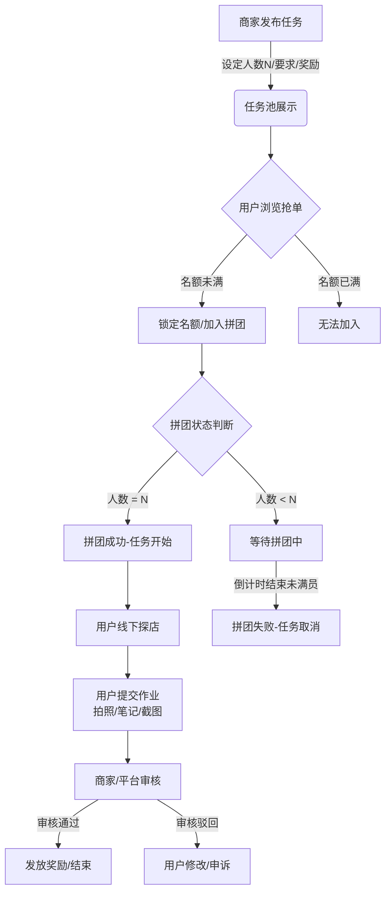

# 组队探店（TeamVisit）产品需求文档 (PRD)

| 文档版本 | 修改日期 | 修改人 | 修改内容 |
| :--- | :--- | :--- | :--- |
| V1.0 | 2026-03-04 | Trae Assistant | 初始版本创建，定义核心拼团抢单流程 |

## 目录
1. [项目背景与目标](#1-项目背景与目标)
2. [用户角色](#2-用户角色)
3. [核心业务流程](#3-核心业务流程)
4. [功能模块详解](#4-功能模块详解)
    - [4.1 首页/任务大厅](#41-首页任务大厅-app小程序端)
    - [4.2 任务详情页](#42-任务详情页)
    - [4.3 拼团逻辑与状态机](#43-拼团逻辑与状态机-后端核心)
    - [4.4 任务执行与交付](#44-任务执行与交付)
    - [4.5 商家/管理端后台](#45-商家管理端后台)
5. [数据库设计概要](#5-数据库设计概要)
6. [非功能性需求](#6-非功能性需求)

---

## 1. 项目背景与目标
### 1.1 背景
商家（餐饮、娱乐等）需要低成本的流量曝光和真实评价（UGC）。普通用户（KOC/探店爱好者）希望通过探店获取免费餐食或佣金。传统的单人探店模式缺乏社交属性，且单人履约率不稳定，商家对接成本高。

### 1.2 目标
打造一个基于“拼团模式”的探店任务分发平台。
- **商家/发布者**：发布多人任务（如“需3人成团”），降低单人对接成本，制造热度，通过团购形式吸引探店。
- **用户**：通过组队/抢单参与探店，完成任务（拍照、写评）后获得奖励。

## 2. 用户角色
| 角色 | 描述 | 核心需求 |
| :--- | :--- | :--- |
| **任务发布者** (商家/运营) | 发布探店需求 | 设置人数门槛、任务详情、审核作业、发放奖励。 |
| **探店用户** (C端) | 抢单参与任务 | 浏览任务、加入拼团、提交作业、查看收益。 |
| **平台管理员** | 全局管理 | 风控管理、纠纷仲裁、资金结算。 |

## 3. 核心业务流程

## 4. 功能模块详解

### 4.1 首页/任务大厅 (App/小程序端)
**功能描述**：展示所有可参与的拼团探店任务，作为流量分发入口。

*   **列表页展示字段**：
    *   **店铺封面图**：吸引点击。
    *   **店铺名称 & 区域**：显示距离（e.g., <500m）。
    *   **拼团进度条**：直观展示紧迫感，例如 `[已拼2人/需5人]`。
    *   **奖励信息**：金额/权益（e.g., 免费霸王餐 / ￥50车马费）。
    *   **倒计时**：剩余拼团时间。
*   **筛选/搜索**：
    *   按区域（商圈）。
    *   按美食类型（火锅、日料等）。
    *   按奖励类型。
    *   快捷筛选：仅看未满员。

### 4.2 任务详情页
**功能描述**：详细展示任务要求，是用户决策抢单的关键页面。

*   **基础信息**：
    *   商家位置（集成地图导航）。
    *   营业时间。
*   **组队信息**：
    *   **当前队友**：展示已占坑用户的头像（增加社交信任感）。
    *   **剩余名额**：实时动态显示。
*   **任务说明（核心）**：
    *   **硬性要求**：e.g., “需大众点评等级Lv3以上”、“需小红书粉丝>1000”。
    *   **执行步骤**：
        1.  到店出示核销码/暗号。
        2.  拍摄不少于3张环境+3张菜品图。
        3.  撰写100字以上好评。
        4.  发布至指定平台（抖音/点评/小红书）。
        5.  保持评价存留7天以上。
*   **底部操作栏**：
    *   状态按钮：`立即拼团` / `拼团已满` / `任务进行中` / `已结束`。

### 4.3 拼团逻辑与状态机 (后端核心)
此模块处理并发抢单逻辑，是系统的核心。

*   **拼团ID (TeamID)**：每个任务生成一个唯一的拼团组。
*   **库存锁定机制**：
    *   用户点击“立即拼团”时，后端进行库存预占（Redis原子操作）。
    *   预占有效期5分钟，超时未确认/支付保证金则释放名额。
*   **成团状态判定**：
    *   **待成团**：已参与人数 < 目标人数。
    *   **拼团成功**：已参与人数 = 目标人数。触发系统通知，任务正式开始倒计时。
    *   **拼团失败**：截止时间到，人数未满。自动取消任务，原路退还保证金。

### 4.4 任务执行与交付
*   **我的任务**：
    *   Tab页：全部、待探店、审核中、已完成。
*   **提交作业页面**：
    *   **多图上传**：支持环境图、菜品图。
    *   **截图上传**：第三方平台发布后的截图凭证。
    *   **链接提交**：外部平台的内容链接（用于系统自动抓取数据，可选）。
    *   **备注信息**：用户填写的补充说明。

### 4.5 商家/管理端后台
*   **发布任务**：
    *   输入项：标题、探店人数（3/5人）、单人预算、任务文案模板、截止时间。
    *   上传项：示例图片（指导用户怎么拍）。
*   **作业审核**：
    *   列表展示某任务下所有用户的提交。
    *   操作：
        *   `通过`：系统自动触发打款流程。
        *   `驳回`：需填写驳回原因（如“图片模糊”、“未露脸”），用户可修改后再次提交。

## 5. 数据库设计概要 (ER草图)

### 5.1 任务表 (tasks)
| 字段名 | 类型 | 描述 |
| :--- | :--- | :--- |
| `id` | BigInt | 主键 |
| `merchant_id` | BigInt | 商家ID |
| `title` | Varchar | 任务标题 |
| `required_count` | Int | **成团所需人数 (e.g., 5)** |
| `reward_amount` | Decimal | 单人奖励金额 |
| `deadline` | DateTime | 截止时间 |
| `status` | TinyInt | 0:招募中, 1:进行中, 2:已结束 |

### 5.2 拼团组表 (team_groups)
| 字段名 | 类型 | 描述 |
| :--- | :--- | :--- |
| `id` | BigInt | 主键 |
| `task_id` | BigInt | 关联任务ID |
| `current_count` | Int | 当前已拼人数 |
| `status` | TinyInt | 0:拼团中, 1:拼团成功, 2:拼团失败 |

### 5.3 参与明细表 (task_participants)
| 字段名 | 类型 | 描述 |
| :--- | :--- | :--- |
| `id` | BigInt | 主键 |
| `team_group_id` | BigInt | 关联拼团组ID |
| `user_id` | BigInt | 用户ID |
| `status` | TinyInt | 0:已占位, 1:已提交, 2:审核通过, 3:驳回 |
| `submission_data` | JSON | 存放作业图片URL、外部链接等 |

## 6. 非功能性需求
1.  **高并发处理**：
    *   核心抢单接口需防止“超卖”（即需要5人，结果进去6个人）。
    *   方案：使用Redis原子操作 (`INCR`, `DECR`) 或数据库悲观锁/乐观锁机制处理抢单扣减库存。
2.  **防作弊**：
    *   **地理位置校验**：用户提交作业时，校验GPS是否在店铺附近（LBS围栏）。
    *   **图片查重**：防止用户使用网图或重复使用图片（MD5校验或感知哈希算法）。
3.  **消息推送**：
    *   拼团成功时，第一时间推送短信/App通知提醒用户尽快探店。
    *   距离任务截止时间24小时自动提醒。
